# M1P - Actividad 1 - Configuración y Pruebas de Proyecto Spring Boot

**Nombre:** Viadis Correa  
**Repositorio forkeado:** https://github.com/vcorreaga/26_b2_r1

---

## 1. Descripción
En esta actividad se realizó la configuración y validación de un proyecto Spring Boot conectado a una base de datos PostgreSQL en la nube mediante Prisma.io.  
También se ejecutaron pruebas de los endpoints CRUD de la API y las pruebas internas del proyecto.

---

## 2. Evidencia de la base de datos en Prisma.io

### 2.1 Proyecto y base de datos creados en Prisma.io
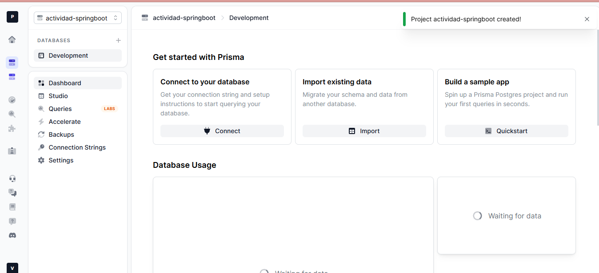

### 2.2 Configuración de connection strings en Prisma.io
> Nota: las credenciales se mantienen ocultas por seguridad.

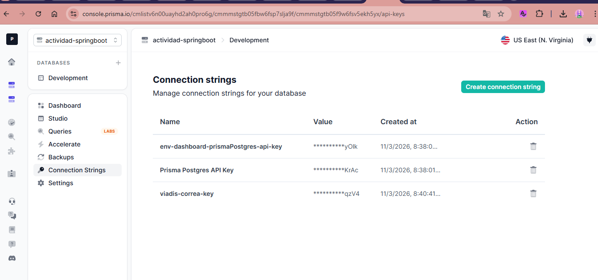

---

## 3. Evidencia de ejecución del proyecto Spring Boot

### 3.1 Ejecución de la aplicación
En esta evidencia se muestra que el proyecto se ejecutó correctamente y quedó disponible en el puerto 8080.

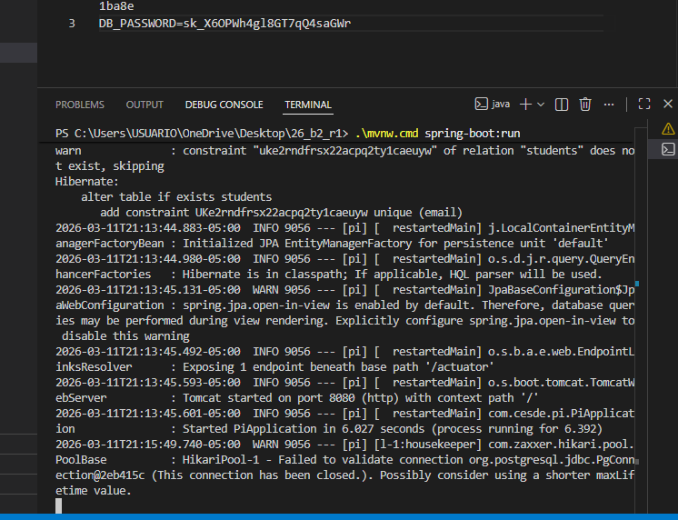

---

## 4. Evidencias de pruebas de la API (CRUD)

### 4.1 GET ALL - Lista inicial de estudiantes
Se verificó inicialmente el endpoint para consultar todos los estudiantes. La respuesta fue una lista vacía.

#### Evidencia desde navegador
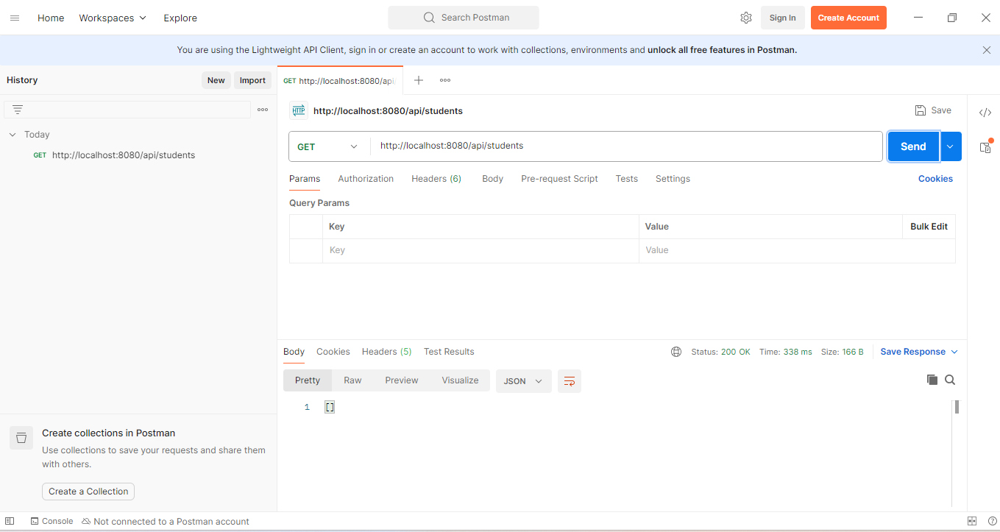

#### Evidencia desde Postman
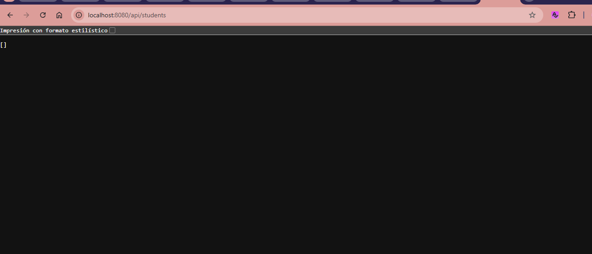

### 4.2 POST - Crear estudiante
Se creó un estudiante de prueba mediante el endpoint POST.

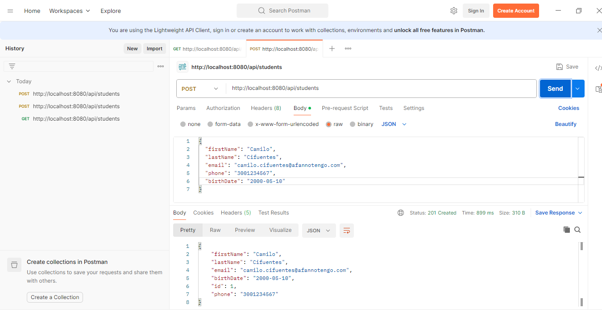

### 4.3 GET ALL - Lista con datos
Después de crear el estudiante, se consultó nuevamente la lista general y ya se visualizó el registro creado.

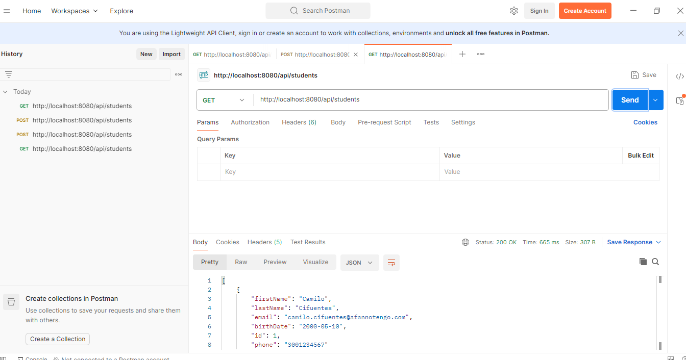

### 4.4 GET by ID - Consultar estudiante por ID
Se consultó el estudiante creado utilizando su ID.

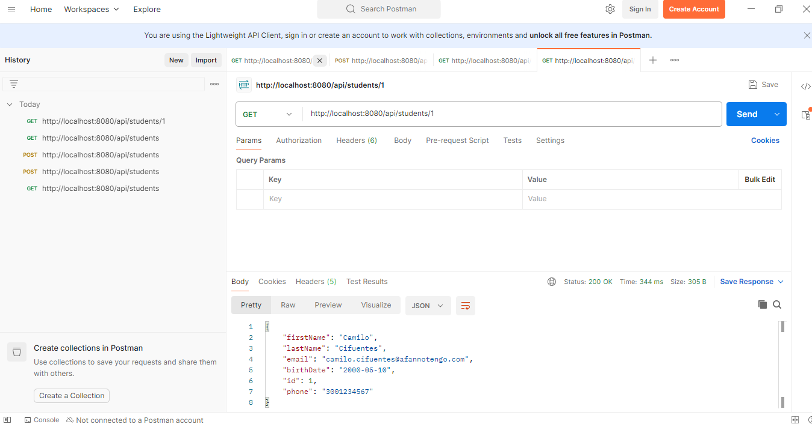

### 4.5 GET by Email - Consultar estudiante por correo electrónico
Se consultó el estudiante usando el correo registrado.

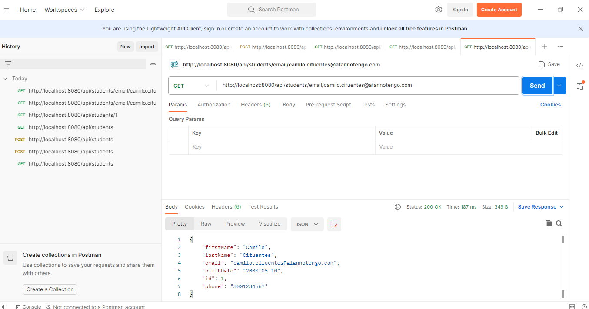

### 4.6 PUT - Actualizar estudiante
Se actualizó la información del estudiante mediante el endpoint PUT.

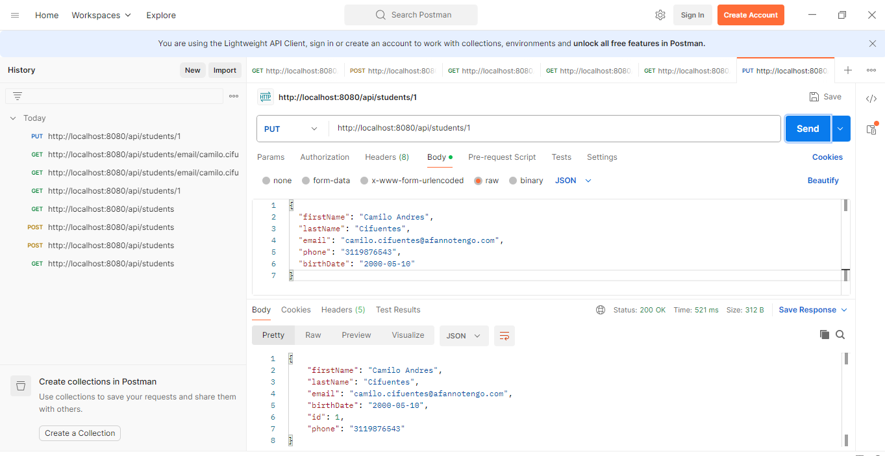

### 4.7 DELETE - Eliminar estudiante
Se eliminó el estudiante creado mediante el endpoint DELETE.

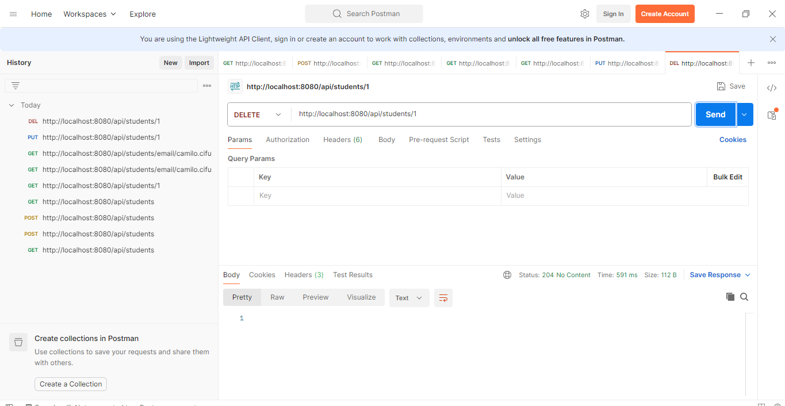

---

## 5. Evidencia de ejecución de pruebas internas

Se ejecutaron las pruebas del proyecto con el siguiente comando:

```bash
.\mvnw.cmd test